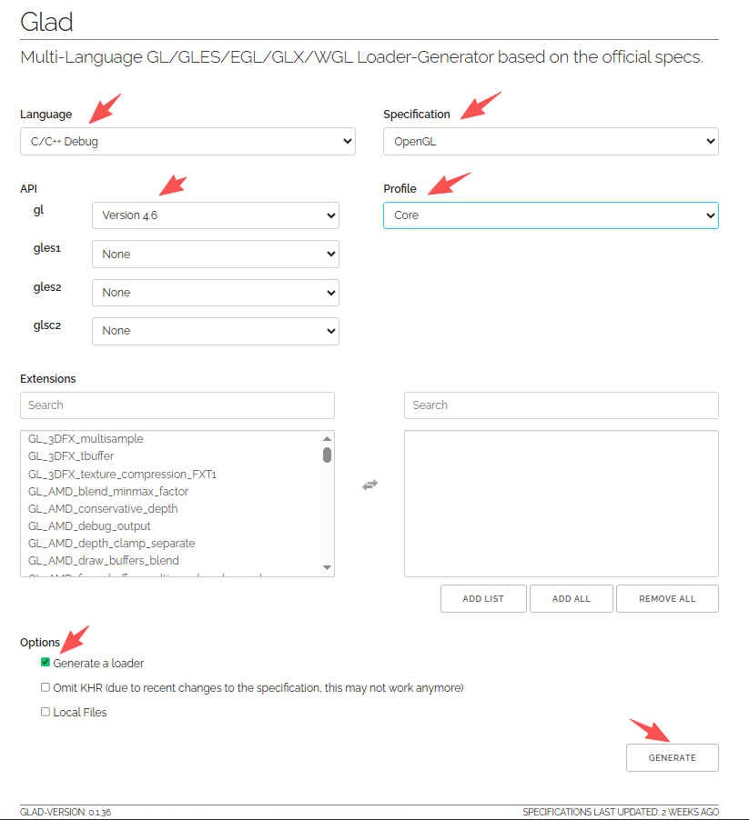
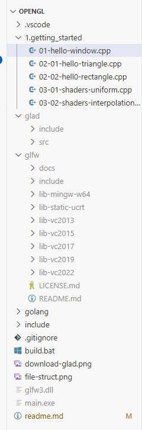

## LearnOpenGL CN
* 教程地址: https://learnopengl-cn.github.io

## C++
安装msys2: https://www.msys2.org/
```sh
# 打开终端 MSYS2 UCRT64, 更新所有包
pacman -Suy --noconfirm
# 安装gcc环境
pacman -S mingw-w64-ucrt-x86_64-gcc
# 有需要时安装gdb调试环境
pacman -S mingw-w64-ucrt-x86_64-gdb
# 需要将 g++.exe,gdb.exe 所在目录添加到PATH环境变量
```

## GLFW
* 下载预编译好的二进制: https://www.glfw.org/download.html
* 解压到当前目录的glfw
* 将 glfw/lib-mingw-w64/glfw3.dll 复制到当前目录


## GLAD
* 仓库地址: https://github.com/Dav1dde/glad
* 下载地址: https://glad.dav1d.de/
* 按如下选项,下载glad.zip:
	* Language: C/C++ Debug
	* Specification: OpenGL
	* gl: Version 4.6 Core
	* Generate a loader
	* 
* 解压到当前目录的glad


## vscode
* 安装扩展:
	* C/C++ Extension Pack
* 目录结构如下如所示:
	* 
* 调试代码
	* 打开要调试的cpp文件(如: 01-hello-window.cpp),按 F5
* 编译代码
	* 打开要编译的cpp文件, Ctrl+Shift+P , 搜索 runtask ,回车后选中 cplus_main 再回车
	* 或者执行 .\build.bat xxx.cpp
* 运行程序
	* 终端执行: .\main.exe


## go-gl
* C++ 不太熟,后面教程都用Go完成
* 在 ./golang 目录下是用go语言编写OpenGL的代码
```sh
# 1. 安装msys2, 参考第一步
# 2. 安装Golang语言环境
# 3. 安装如下两个库
go get "github.com/go-gl/gl/v4.4-core/gl" "github.com/go-gl/glfw/v3.3/glfw"
# 4. 执行编译脚本
cd golang
.\build.bat 01-hello-window
```
